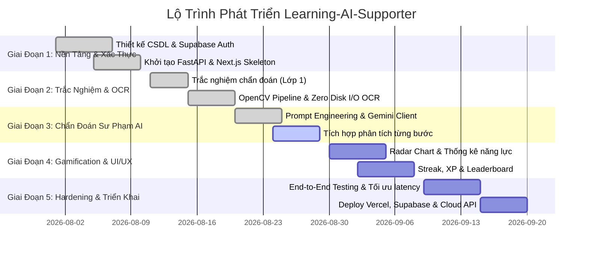

# 🗺️ SpecKit Project Plan & Roadmap — AI Learning Platform (Learning-AI-Supporter)

> **Mục đích**: Kế hoạch hành động, phân chia giai đoạn (Phases), các cột mốc (Milestones), nhiệm vụ kỹ thuật và chiến lược kiểm thử cho hệ thống **AI Learning Platform**.

---

## 1. 🏁 Tổng Quan Các Giai Đoạn Phát Triển (Development Phases)

---

## 2. 📋 Chi Tiết Từng Giai Đoạn (Detailed Phase Breakdown)

### 🔹 Giai Đoạn 1: Thiết Lập Nền Tảng & Hạ Tầng (Foundation & Infrastructure)
- [x] **Khởi tạo kiến trúc repository**: Cấu trúc thư mục chuẩn cho `frontend/`, `backend/`, `internal-tools/`, `docs/`.
- [x] **Thiết kế Schema CSDL**:
  - Viết `schema.sql` và `seed.sql` với các bảng: `subjects`, `topics`, `user_stats`, `user_topic_stats`, `questions`, `submissions`.
- [x] **Hệ thống Xác thực (Authentication)**:
  - Tích hợp Supabase Auth (Sign Up, Sign In, Forgot Password, Get Profile).
  - Triển khai cơ chế Development Fallback Mode khi không có kết nối Supabase trực tiếp.

### 🔹 Giai Đoạn 2: Trắc Nghiệm Chẩn Đoán & Math OCR Engine (Layers 1 & 2)
- [x] **Phân hệ Trắc nghiệm chẩn đoán (Layer 1)**:
  - Tạo endpoint `/api/v1/quizzes/{subject_id}` và `/api/v1/quizzes/submit`.
  - Logic xác định các chuyên đề bị hổng kiến thức (`weak_topics`).
- [x] **Mathematical OCR Pipeline (Layer 2 - Zero Disk I/O)**:
  - Xử lý ảnh byte stream trong RAM bằng OpenCV: Chuyển xám, làm mịn Gaussian, nhị phân hóa cục bộ thích ứng.
  - Tích hợp Gemini Vision Math OCR Service chuyển đổi ảnh bài viết tay thành công thức LaTeX chuẩn.
  - Viết bộ Unit Test toàn diện `tests/test_extract_math.py` kiểm tra hiệu năng và khả năng chịu lỗi.

### 🔹 Giai Đoạn 3: Chẩn Đoán Sư Phạm Chuyên Sâu Gemini AI (Layer 3)
- [x] **Xây dựng module Gemini Client sư phạm**:
  - Thiết kế System Prompts chuyên sâu cho từng môn học (Toán, Lý, Hóa).
  - Phân tích bước sai (`detected_error_step`), phân loại lỗi (`error_type`), nhận xét từng bước (`steps_breakdown`).
  - Tạo lời giải mẫu dạng LaTeX chuẩn (`remedial_latex_solution`).
- [ ] **Hoàn thiện UI hiển thị phản hồi sư phạm**:
  - Giao diện hiển thị trực quan các bước làm đúng/sai với màu sắc phân biệt (Xanh lá / Đỏ).
  - Trình hiển thị công thức toán học KaTeX/MathJax mượt mà trên frontend.

### 🔹 Giai Đoạn 4: Gamification, Analytics & Frontend Redesign (Đang Triển Khai)
- [x] **Cơ chế Gamification & Thống kê**:
  - Tính điểm kinh nghiệm (XP) sau mỗi lượt nộp bài thành công.
  - Tính chuỗi ngày học liên tục (Streak).
  - Trang hiển thị Bảng xếp hạng (`/leaderboard`).
- [/] **Frontend Redesign & Modular Layout (Aesthetic & Multi-Action Home)**:
  - Đồng bộ giao diện toàn hệ thống theo ngôn ngữ thiết kế của `login.tsx` (Nền mây trời `clouds-bg.jpg`, Card kính mờ `backdrop-blur-md bg-[#f4f7fb]/95`, viền mỏng tinh tế, màu thương hiệu `#1e3c72`).
  - Xây dựng Layout tái sử dụng (`AppLayout`, `Navbar`, `Footer`) chia tách rõ ràng theo chức năng.
  - Thiết kế trang chủ (`index.tsx`) tương tác với 4 tùy chọn cốt lõi:
    1. **Làm Trắc Nghiệm Chẩn Đoán** (`/quiz`)
    2. **Làm Bài Tự Luận & OCR** (`/submission`)
    3. **Xem Bảng Đánh Giá Năng Lực** (`/evaluation`)
    4. **Chatbox Hỏi Bài Với AI Gia Sư** (`/chat`)
  - Xây dựng các trang đích placeholder có cùng giao diện nền và cấu trúc chuẩn bị cho tích hợp logic chuyên sâu.
  - Quản lý điều hướng tập trung qua `services/navigation.ts` không hardcode URL rải rác.
- [ ] **Biểu đồ Năng lực Radar Chart**:
  - Tích hợp thư viện Recharts để trực quan hóa điểm thành thạo của học sinh theo từng chuyên đề môn học.
- [x] **Internal Monitoring Dashboard**:
  - Xây dựng dashboard Streamlit (`internal-tools/dashboard/app.py`) để theo dõi telemetry và số liệu hoạt động.

### 🔹 Giai Đoạn 5: Kiểm Thử, Tối Ưu & Triển Khai (Hardening & Deployment)
- [ ] **Kiểm thử tự động & Tải (Stress Testing)**:
  - Đo lường độ trễ của pipeline OCR và Gemini AI dưới tải đồng thời nhiều người dùng.
  - Đảm bảo thời gian xử lý trung bình `< 1500ms`.
- [ ] **Triển khai Production**:
  - Frontend: Deploy lên **Vercel** (Next.js Edge Network).
  - Backend API: Deploy Container Docker lên Cloud Provider (Render / Railway / Cloud Run).
  - Database: Kết nối trực tiếp cơ sở dữ liệu **Supabase PostgreSQL**.

---

## 3. 🧪 Kế Hoạch Kiểm Thử & Đảm Bảo Chất Lượng (Verification & QA Strategy)

| Loại Kiểm Thử | Đối Tượng Kiểm Thử | Công Cụ / Framework | Tiêu Chí Đạt Chuẩn (Acceptance Criteria) |
| :--- | :--- | :--- | :--- |
| **Unit Tests** | `ai/ocr/image_processing.py`, `ai/ocr/math_ocr_service.py` | `pytest`, `pytest-asyncio` | 100% test cases trong `tests/test_extract_math.py` pass; Không có lỗi rò rỉ RAM hay ghi đĩa. |
| **Integration Tests** | REST API Endpoints (`/extract-math`, `/ai/analyze`, `/quizzes/submit`) | `httpx`, `FastAPI TestClient` | Status code trả về đúng chuẩn (200, 400, 401, 500); Schema response khớp Pydantic models. |
| **AI Evaluation** | Tính chính xác của phân tích sư phạm Gemini | Bộ bài kiểm tra mẫu (Golden Dataset) | Xác định đúng bước sai >= 95% đối với các lỗi cơ bản (đổi đơn vị, sai công thức, sai số học). |
| **E2E & UI Testing** | Luồng người dùng từ làm trắc nghiệm đến nộp ảnh bài làm | Kiểm thử trình duyệt / Playwright | Giao diện tải mượt mà, upload ảnh trơn tru, hiển thị công thức LaTeX chính xác không bị vỡ giao diện. |

---

## 4. ⚠️ Đánh Giá Rủi Ro & Giải Pháp Khắc Phục (Risk Management)

1. **Rủi ro Rate Limit hoặc Quá Tải Gemini API**:
   - *Giải pháp*: Triển khai xoay vòng danh sách khóa API (`parse_api_keys()` multi-key rotation) và cơ chế Mock fallback tự động.
2. **Rủi ro chất lượng ảnh chụp bài làm kém (mờ, tối, méo)**:
   - *Giải pháp*: Pipeline tiền xử lý ảnh OpenCV với Gaussian Blur và Adaptive Thresholding tự động làm sạch nền giấy và nổi bật nét chữ viết.
3. **Rủi ro rò rỉ bộ nhớ khi xử lý ảnh liên tục**:
   - *Giải pháp*: Sử dụng giải phóng buffer byte stream ngay sau khi decode và không lưu trữ trạng thái dư thừa trong RAM.
