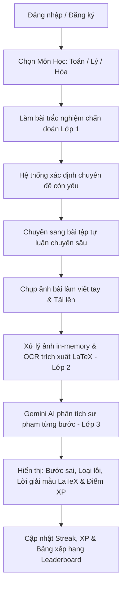

# 📋 SpecKit System Specification — AI Learning Platform (Learning-AI-Supporter)

> **Trạng thái**: Hoạt động & Đang phát triển  
> **Phiên bản**: 1.2.0  
> **Mục đích**: Đặc tả chi tiết toàn diện về tính năng, kiến trúc kỹ thuật, luồng dữ liệu, hợp đồng API và các tiêu chí phi chức năng cho hệ thống **AI Learning Platform**.

---

## 1. 🎯 Tổng Quan Hệ Thống (System Overview)

**Learning-AI-Supporter** là nền tảng giáo dục thông minh chuyên sâu cho 3 môn tự nhiên (**Toán Học**, **Vật Lý**, **Hóa Học**). Hệ thống giúp học sinh phát hiện và khắc phục chính xác "lỗ hổng kiến thức" thông qua quy trình đánh giá chẩn đoán 3 lớp (*3-Layer Diagnostic System*):
1. **Lớp 1 (Chẩn đoán diện rộng)**: Trắc nghiệm nhanh để khoanh vùng chuyên đề yếu.
2. **Lớp 2 (Nhận diện bài làm tự luận)**: OCR chữ viết tay và công thức toán học xử lý hoàn toàn trong RAM (Zero Disk I/O) chuyển đổi thành định dạng chuẩn LaTeX.
3. **Lớp 3 (Phân tích sư phạm AI)**: Sử dụng Gemini AI phân tích từng bước làm bài, chỉ ra lỗi sai cụ thể, phân loại dạng lỗi và đề xuất lộ trình ôn tập khắc phục.

---

## 2. 👥 Đối Tượng Người Dùng & Hành Trình Trải Nghiệm (User Personas & Journeys)

### 2.1 Đối tượng người dùng
- **Học sinh (Primary Users)**: Muốn kiểm tra năng lực, tự luyện bài tập tự luận, nhận phản hồi sư phạm tức thì và theo dõi sự tiến bộ qua biểu đồ năng lực (Radar Chart) và Bảng xếp hạng.
- **Giáo viên / Phụ huynh (Secondary Users)**: Theo dõi tiến độ học tập, xem báo cáo thống kê các dạng lỗi sai phổ biến của học sinh.
- **Quản trị viên / Đội ngũ kỹ thuật (Admin/DevOps)**: Giám sát lưu lượng API, tỷ lệ lỗi nhận diện OCR và quản lý ngân hàng đề qua Dashboard nội bộ (Streamlit).

### 2.2 Hành trình người dùng tiêu chuẩn (Happy Path)


---

## 3. 🧩 Đặc Tả Chi Tiết Các Phân Hệ (Functional Specifications)

### 3.1 Phân hệ 1: Môn Học & Trắc Nghiệm Chẩn Đoán (Layer 1)
- **Danh mục môn học**:
  - `math` (Toán Học): Đại số, Giải tích, Hình học không gian, Oxyz, Đạo hàm & Cực trị.
  - `physics` (Vật Lý): Dao động cơ, Sóng cơ, Điện xoay chiều, Quang học, Đơn vị đo SI.
  - `chemistry` (Hóa Học): Hóa vô cơ, Hóa hữu cơ, Phản ứng oxi hóa khử, Cân bằng hóa học.
- **Tính năng**:
  - Tải danh sách câu hỏi trắc nghiệm chẩn đoán theo từng môn học.
  - Chấm điểm tự động và tổng hợp danh sách các chuyên đề bị hổng kiến thức (`weak_topics`).

### 3.2 Phân hệ 2: Mathematical OCR & Xử Lý Ảnh (Layer 2)
- **Đặc tả kỹ thuật Zero Disk I/O**:
  - Không tạo bất kỳ file tạm nào trên ổ đĩa máy chủ (`/tmp` hoặc ổ cứng vật lý).
  - Tiếp nhận luồng bytes trực tiếp từ `UploadFile`.
  - Tiền xử lý ảnh với OpenCV trong bộ nhớ:
    1. Chuyển đổi định dạng: BGR sang Grayscale.
    2. Khử nhiễu: Áp dụng bộ lọc làm mịn Gaussian Blur.
    3. Tăng độ tương phản: Áp dụng Adaptive Gaussian Thresholding (nhị phân hóa thích ứng).
  - Đưa ảnh đã làm nét vào engine nhận diện (`Gemini Vision` hoặc fallback OCR Engine) để trích xuất công thức toán dạng LaTeX chuẩn (ví dụ: `\omega = \sqrt{\frac{k}{m}}`).
  - Đo lường và trả về thời gian xử lý theo mili-giây (`processing_time_ms`).

### 3.3 Phân hệ 3: Chẩn Đoán Sư Phạm Chuyên Sâu Gemini AI (Layer 3)
- **Yêu cầu phân tích sư phạm**:
  - Nhận đầu vào: Đề bài (`question_content`), Bài làm học sinh (`student_solution_text`), Môn học (`subject`).
  - Phân tích chi tiết từng bước (`steps_breakdown`):
    - `step_number`: Thứ tự bước giải.
    - `content`: Nội dung công thức / câu chữ ở bước đó.
    - `is_correct`: Đúng/Sai (`true`/`false`).
    - `comment`: Nhận xét sư phạm ngắn gọn cho bước đó.
  - Xác định vị trí lỗi đầu tiên (`detected_error_step`).
  - Phân loại lỗi (`error_type`):
    - Lỗi sai bản chất khái niệm.
    - Lỗi sai công thức định lý.
    - Lỗi sai đơn vị đo (chưa đổi SI, nhầm đơn vị).
    - Lỗi tính toán số học / biến đổi đại số.
  - Lời khuyên ôn tập (`suggested_revision`).
  - Lời giải mẫu khắc phục bằng chuẩn LaTeX (`remedial_latex_solution`).

### 3.4 Phân hệ 4: Gamification & Thống Kê Năng Lực
- **Cơ chế Gamification**:
  - Cộng điểm kinh nghiệm (XP) sau khi hoàn thành bài test và sửa lỗi sai tự luận thành công.
  - Tính chuỗi ngày học liên tiếp (`streak_days`).
  - Bảng xếp hạng vinh danh (`Leaderboard`) hiển thị top học sinh có XP cao nhất.
- **Biểu đồ Radar Topic Mastery**:
  - Thống kê tỷ lệ thành thạo (0% - 100%) của học sinh trên từng chuyên đề nhỏ để trực quan hóa điểm mạnh và điểm yếu.

### 3.5 Phân hệ 5: Xác Thực & Quản Lý Hồ Sơ (Authentication)
- Tích hợp Supabase Auth với JWT Bearer Tokens:
  - Đăng ký (`/auth/register`), Đăng nhập (`/auth/login`), Quên mật khẩu (`/auth/forgot-password`), Lấy thông tin cá nhân (`/auth/me`), Đăng xuất (`/auth/logout`).
- Hỗ trợ chế độ phát triển ngoại tuyến (**Development Fallback Mode**) khi chưa cấu hình Supabase URL/Key.

---

## 4. 📡 Đặc Tả Hợp Đồng Giao Tiếp API (API Contracts)

### 4.1 Nhận Diện Công Thức Toán Học
- **Endpoint**: `POST /api/v1/extract-math` (hoặc `/api/v1/ocr/upload`)
- **Headers**:
  - `Content-Type: multipart/form-data`
  - `x-gemini-api-key: <string>` *(Tùy chọn: ghi đè API key của client)*
- **Response Schema**:
```json
{
  "status": "success",
  "processing_time_ms": 420.5,
  "latex_formula": "\\omega = \\sqrt{\\frac{k}{m}} = \\sqrt{\\frac{100}{0.2}} = 10\\sqrt{5}\\text{ rad/s}"
}
```

### 4.2 Phân Tích Sư Phạm Gemini
- **Endpoint**: `POST /api/v1/ai/analyze`
- **Request Body**:
```json
{
  "subject": "physics",
  "question_content": "Tính tần số góc của con lắc lò xo có k = 100 N/m, m = 200g.",
  "student_solution_text": "\\omega = \\sqrt{\\frac{k}{m}} = \\sqrt{\\frac{100}{200}} = 0.707\\text{ rad/s}"
}
```
- **Response Schema**:
```json
{
  "detected_error_step": 2,
  "error_type": "Lỗi sai đơn vị (chưa đổi gam sang kilôgam)",
  "detailed_feedback": "Học sinh áp dụng đúng công thức nhưng mắc lỗi chuyển đổi đơn vị đo khối lượng ở bước thay số.",
  "steps_breakdown": [
    {
      "step_number": 1,
      "content": "\\omega = \\sqrt{k/m}",
      "is_correct": true,
      "comment": "Đúng công thức tính tần số góc của con lắc lò xo."
    },
    {
      "step_number": 2,
      "content": "\\omega = \\sqrt{100/200}",
      "is_correct": false,
      "comment": "Sai lầm: Khối lượng m = 200g cần đổi sang đơn vị chuẩn SI là 0.2kg trước khi tính."
    }
  ],
  "suggested_revision": "Quy tắc đổi đơn vị chuẩn SI trong cơ học",
  "remedial_latex_solution": "$$\\omega = \\sqrt{\\frac{100}{0.2}} = 10\\sqrt{5}\\approx 22.36\\text{ rad/s}$$"
}
```

---

## 5. 🗄️ Cấu Trúc Cơ Sở Dữ Liệu (Database Schemas)

| Bảng (Table) | Khóa Chính | Mô Tả |
| :--- | :--- | :--- |
| `subjects` | `id (VARCHAR)` | Danh mục các môn học (`math`, `physics`, `chemistry`). |
| `topics` | `id (UUID)` | Chuyên đề thuộc từng môn học (ví dụ: Dao động cơ, Đạo hàm). |
| `user_stats` | `user_id (UUID)` | Thống kê học sinh: Họ tên, email, `total_xp`, `streak_days`. |
| `user_topic_stats` | `id (UUID)` | Điểm làm chủ kiến thức (`mastery_score`: 0-100) theo từng chuyên đề. |
| `questions` | `id (UUID)` | Ngân hàng câu hỏi trắc nghiệm & tự luận kèm lời giải mẫu. |
| `submissions` | `id (UUID)` | Lịch sử nộp bài, ảnh chụp, kết quả OCR và phản hồi sư phạm AI. |

---

## 6. ⚡ Tiêu Chí Phi Chức Năng (Non-Functional Requirements)

1. **Hiệu năng & Độ trễ (Performance)**:
   - Luồng OCR tiền xử lý OpenCV in-memory phải hoàn tất trong vòng `< 150ms`.
   - Tổng thời gian phản hồi API OCR + Gemini Vision `< 2000ms`.
2. **Khả năng tương thích (Compatibility)**:
   - Giao diện Frontend tương thích tối ưu trên cả thiết bị di động (Mobile Web) và máy tính để bàn (Desktop).
   - Hỗ trợ các định dạng ảnh phổ biến: PNG, JPEG, WEBP, BMP, TIFF.
3. **Độ tin cậy & Sẵn sàng (Reliability)**:
   - 99.9% Uptime, không để lỗi xử lý ảnh làm treo process FastAPI.
   - Luôn có Mock fallback cho các dịch vụ bên thứ ba khi chạy thử nghiệm nội bộ.