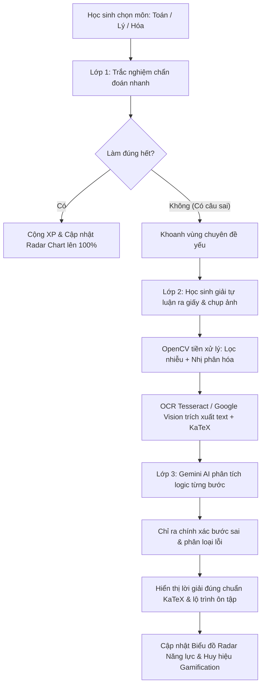

# Kiến Trúc Hệ Thống: AI Learning Supporter

Hệ thống Hỗ trợ Học tập Đa môn áp dụng AI (Toán, Lý, Hóa) được xây dựng dựa trên nguyên tắc **Module hóa cao**, **Chi phí vận hành 0đ** (sử dụng tier miễn phí của Vercel, Render/Railway, Supabase, Google Gemini API) và **Đánh giá năng lực 3 lớp**.

---

## 1. Sơ đồ Luồng Hoạt Động 3 Lớp (Core 3-Layer Workflow)

---

## 2. Kiến Trúc Phân Tầng Công Nghệ

| Thành Phần | Công Nghệ | Vai Trò & Tính Năng Nổi Bật |
| :--- | :--- | :--- |
| **Frontend Web** | Next.js (App Router), TypeScript, Tailwind CSS | Giao diện Responsive hiện đại, tối ưu SEO, hỗ trợ KaTeX công thức toán học, biểu đồ Radar với Recharts |
| **Backend API** | Python FastAPI, Uvicorn, Pydantic | RESTful API hiệu năng cao, xử lý đa luồng cho tác vụ OCR & gọi mô hình ngôn ngữ lớn |
| **Database & Auth** | Supabase (PostgreSQL) | Lưu trữ quan hệ đa môn (Subjects, Topics, Questions, Submissions, User Stats, Badges) |
| **AI Engine** | Google Gemini API (1.5 Flash) | Prompt Engineering chuyên biệt cho 3 môn tự nhiên, chẩn đoán logic sư phạm |
| **OCR Pipeline** | OpenCV & Tesseract OCR / Cloud Vision | Làm rõ nét ảnh chụp chữ viết tay vở bài tập và chuyển sang số hóa |
| **Prototype Dashboard** | Streamlit, Plotly, Pandas | Dựng nhanh giao diện kiểm thử logic nghiệp vụ nội bộ trước khi chuyển sang React |

---

## 3. Phân Quyền & Vai Trò Phát Triển

1. **Software Engineer (Kỹ sư Phần mềm)**:
   - Phát triển toàn bộ các trang trên Next.js (`/quiz`, `/submission`, `/analysis`, `/dashboard`).
   - Tối ưu hóa trải nghiệm tải ảnh (drag-and-drop, camera mobile preview) và hiển thị công thức toán học KaTeX.
   
2. **AI Engineer (Kỹ sư AI)**:
   - Tinh chỉnh Pipeline xử lý ảnh với OpenCV (`cv2.bilateralFilter`, `cv2.adaptiveThreshold`).
   - Thiết kế và tối ưu Prompt Engineering cho từng môn học (Toán, Lý, Hóa) trong `backend/app/services/gemini_service.py`.
   - Xử lý các trường hợp biên khi chữ viết tay quá xấu hoặc công thức phức tạp.

3. **DevOps & Backend Engineer (Kỹ sư Hệ thống)**:
   - Quản trị CSDL Supabase PostgreSQL, viết migration và view tối ưu cho Leaderboard.
   - Xây dựng API FastAPI bảo mật, phân quyền JWT, xử lý CORS.
   - Vận hành Streamlit Dashboard nội bộ để phân tích dữ liệu học tập.
