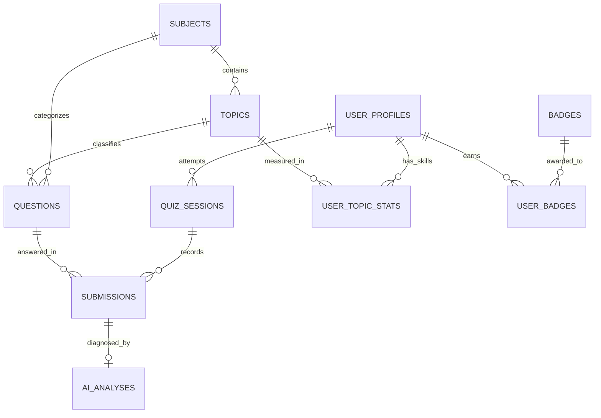

# Thiết Kế Cơ Sở Dữ Liệu: Supabase / PostgreSQL

Cơ sở dữ liệu được thiết kế theo mô hình quan hệ chuẩn hóa cao (3NF), hỗ trợ mở rộng không giới hạn môn học và chuyên đề.

---

## 1. Sơ đồ Thực thể Quan hệ (ERD)

---

## 2. Danh Sách Các Bảng Cốt Lõi

1. **`subjects`**: Lưu thông tin 3 môn học cốt lõi (`math`, `physics`, `chemistry`).
2. **`topics`**: Danh mục cây chủ đề kiến thức (Knowledge Graph) phục vụ biểu đồ Radar.
3. **`user_profiles`**: Hồ sơ học sinh, lớp, tổng điểm kinh nghiệm (XP) và chuỗi học tập (Streak).
4. **`questions`**: Kho câu hỏi trắc nghiệm & tự luận hỗ trợ mã hóa công thức KaTeX/LaTeX.
5. **`quiz_sessions`**: Phiên làm bài kiểm tra chẩn đoán Lớp 1.
6. **`submissions`**: Lưu bài làm, đáp án trắc nghiệm hoặc URL ảnh chụp bài tự luận (Lớp 2).
7. **`ai_analyses`**: Kết quả phân tích sâu từng bước giải của Gemini AI (Lớp 3).
8. **`user_topic_stats`**: Điểm kỹ năng (0-100) theo từng chuyên đề dùng để vẽ Radar Chart.
9. **`badges` & `user_badges`**: Hệ thống huy hiệu Gamification.
10. **`view_leaderboard`**: View tính toán xếp hạng thời gian thực dựa trên XP.
